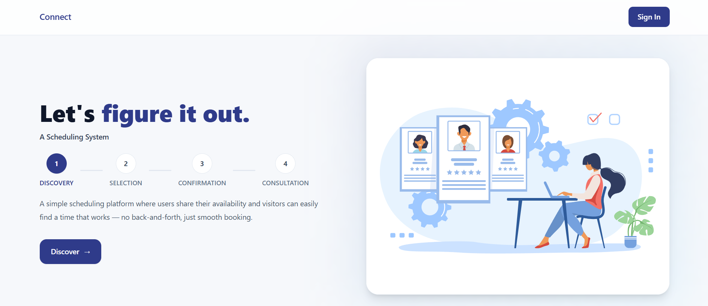
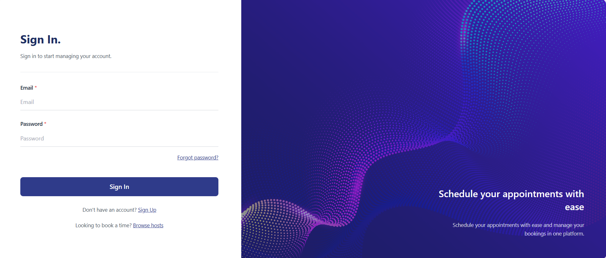
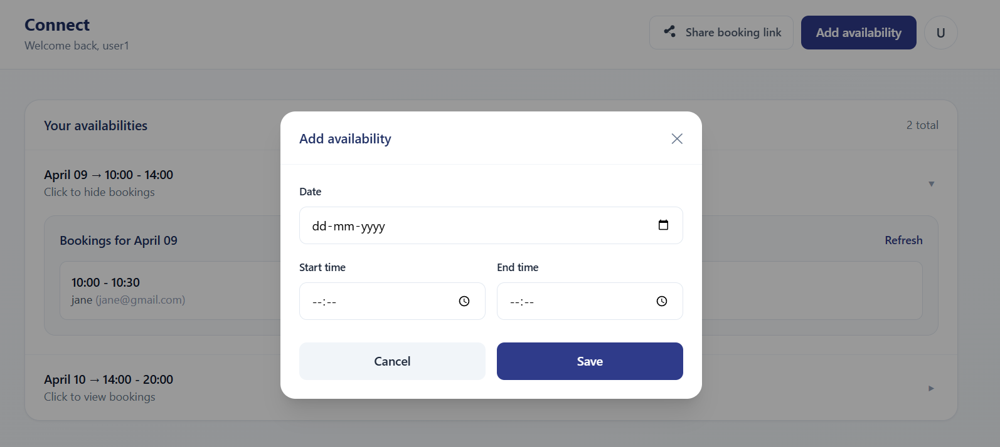
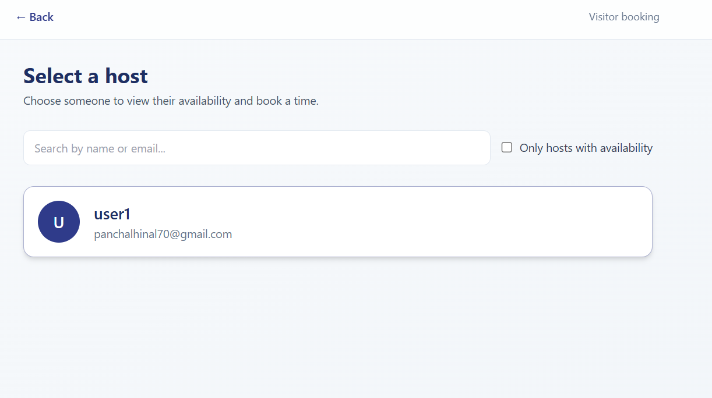

# Slot Booking System — Frontend (React)

React (CRA) frontend for a simple scheduling platform.

- **User (host) side**: sign in, add availability, share booking link
- **Visitor side**: discover hosts (or open a shared link), view available dates/slots, book a time

---
## Backend of this System : https://github.com/Hinall/slot-booking-system-backend
## Screenshots

### Home (shared landing for user + visitor)



### User side (host)

- **1) Sign in**



- **2) Add availability**
- **3) Generate booking link of user**



### Visitor side

- **1) Visitor can access user schedule** by shared link (`/book/:userId`) **or** click **Discover** on Home to see all users



- **2) Book a slot**


---

## Routes

- `/` — Home (visitor landing)
- `/signin` — Sign in (user)
- `/dashboard` — User dashboard (add availability + share booking link)
- `/users` — Visitor: list all users (hosts)
- `/book/:userId` — Visitor: booking page for a selected user

---

## Environment

Create a `.env` file:

```env
REACT_APP_API_URL=http://localhost:3000/api
```

Restart the dev server after changing `.env`.

---

## Run locally

```bash
npm install
npm start
```

The dev server runs on `http://localhost:3001` (or whichever port CRA selects if 3000 is already in use).
